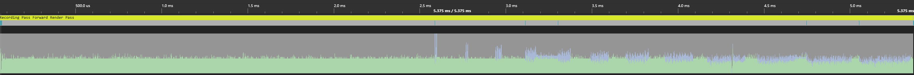
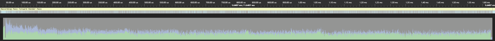
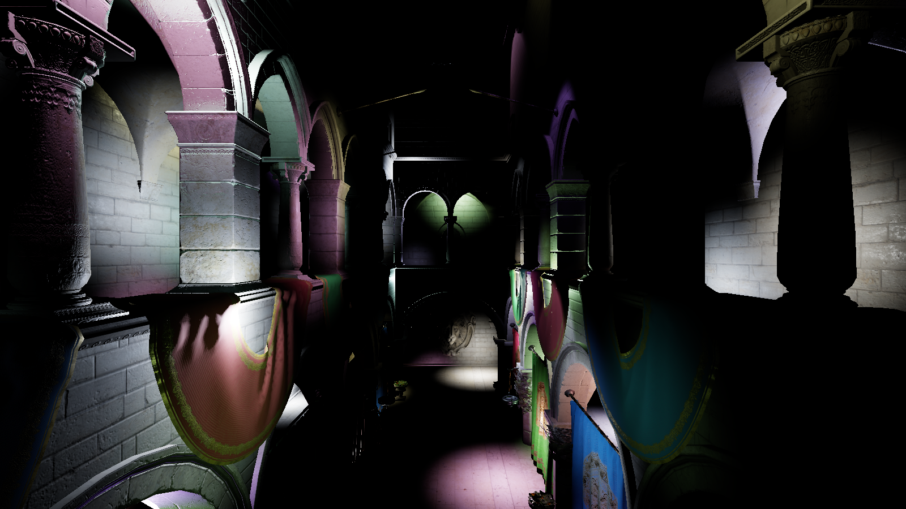
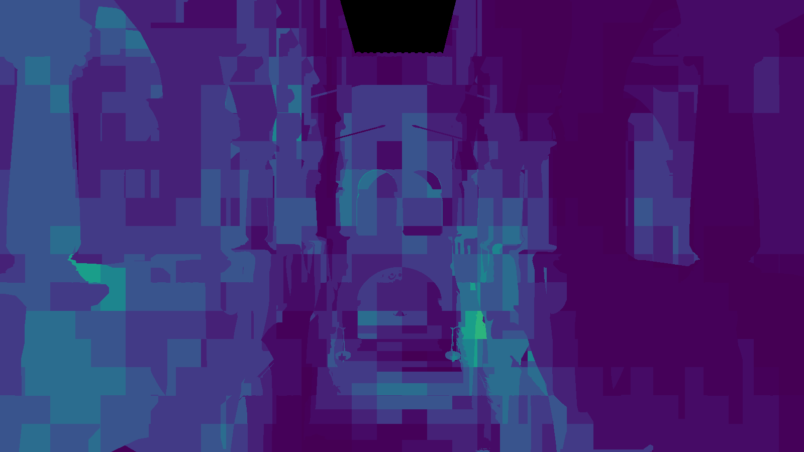

# ZEC

- [ZEC](#zec)
  - [Introduction](#introduction)
    - [Building](#building)
    - [Dependencies](#dependencies)
  - [Techniques](#techniques)
    - [Image Based Lighting](#image-based-lighting)
    - [ISPC Accelerated View Frustum Culling](#ispc-accelerated-view-frustum-culling)
    - [Clustered Forward Shading](#clustered-forward-shading)
  - [`zec::gfx`](#zecgfx)
    - [Render Pass Abstraction](#render-pass-abstraction)
  - [Examples folder](#examples-folder)

## Introduction

A very much Work In Progress renderer that wraps the D3D12 API.

The primary goal is to provide example implementations of various computer graphics techniques such as clustered shading, PBR shading, etc. and the secondary goal is to do it efficiently using a simple, thin abstraction around D3D12.

It's an extension of my other repo, [BAE](https://github.com/bruop/bae), but here I'm implementing the rendering abstraction myself rather than using BGFX (which is great, just wanted to learn more about building lower level abstractions).


### Building

The project uses [premake](https://premake.github.io/) to generate project files, but I've only tested support for creating a Visual Studio 2019 solution. To create the solution, open up Powershell and run:

```
$ make generate
```

This will create the solutions in the `.build` folder.

Annoyingly, the way that premake adds the nuget package for the [WindowsPixRuntime](https://devblogs.microsoft.com/pix/winpixeventruntime/) is a bit broken, so you'll likely get errors telling you that the package is missing. It uses `build\native\WinPixEvent` instead of the actual path which is `build\WinPixEvent`. If you're using MYSYS or another terminal that supports `sed` then you can just run the following after the generation step:

```
$ make fix
```

Alternatively, just run `make` to both generate and fix at once (if you can use `sed`).

### Dependencies

For now, I'm including all the non-nuget dependencies used inside `external` and their licenses are included in each folder of`external/include`. Here's a complete list:

- A single header from `boost_context` which FibreTaskingLib needs
- [Catch2](https://github.com/catchorg/Catch2)
- [D3D12MemAlloc](https://github.com/GPUOpen-LibrariesAndSDKs/D3D12MemoryAllocator)
- [d3dx12](https://github.com/Microsoft/DirectX-Graphics-Samples/tree/master/Libraries/D3DX12)
- [DirectX Shader Compiler](https://github.com/microsoft/DirectXShaderCompiler)
- [DirectXTex texture processing library](https://github.com/microsoft/DirectXTex/)
- [FibreTaskingLib](https://github.com/RichieSams/FiberTaskingLib)
- [gainput](https://github.com/jkuhlmann/gainput)
- [Dear Imgui](https://github.com/ocornut/imgui)
- [imgui-filebrowser](https://github.com/AirGuanZ/imgui-filebrowser)
- [MurmurHash3](https://github.com/aappleby/smhasher/blob/master/src/MurmurHash3.cpp)
- [Pix runtime headers](https://devblogs.microsoft.com/pix/)
- [Optick](https://optick.dev/)
- [tinygltf](https://github.com/syoyo/tinygltf)

Not all of these are being fully utilized -- for instance, FTL was used for some experiments but most of the code is not multi-threaded (yet).

## Techniques

Currently, the following implementations have been created, in part as a way of [dogfooding](https://en.wikipedia.org/wiki/Eating_your_own_dog_food) my rendering abstraction:

- Image based lighting with multiple scattering
- ISPC accelerated view frustum culling, as documented in [another blog post](https://bruop.github.io/improved_frustum_culling/)
- Clustered Forward Shading using compute shaders
- More, coming soon

### Image Based Lighting

This is largely a port of the work I previously documented in a [blog post](https://bruop.github.io/ibl/) that used BGFX. The implementation is based off [Karis 2013](https://cdn2.unrealengine.com/Resources/files/2013SiggraphPresentationsNotes-26915738.pdf) and uses compute shaders to produce the pre-filtered irradiance and radiance cube maps documented in that paper.

Additionally, it features corrections for multiple scattering based on [Fdez-Agüera 2019](http://www.jcgt.org/published/0008/01/03/paper.pdf) that improve conservation of energy for metals at higher roughness values.


### ISPC Accelerated View Frustum Culling

Most of the details are in the two blog posts ([part 1](https://bruop.github.io/frustum_culling/), and [part 2](https://bruop.github.io/improved_frustum_culling/)) but to summarize the view culling transforms model-space AABBs to view space and performs a check using the [separating axis theorem](https://en.wikipedia.org/wiki/Hyperplane_separation_theorem) against the view frustum to determine whether the object is in view or not. [ISPC](https://ispc.github.io/) is used to vectorize the system and test 8 AABBs at once.

For 10,000 AABBs, **the system can produce a visibility list in about 0.3ms** using a single core on my i5 6600k.

Here's a graphic of how this reduces wasted vertex work on the GPU as well, as without culling the GPU ends up spending time executing vertex shader work without any corresponding fragment/pixel shader output:



With culling, the wasted work is reduced greatly:




### Clustered Forward Shading

Largely based off [Olsson et al, 2012](http://www.cse.chalmers.se/~uffe/clustered_shading_preprint.pdf), this implementation uses compute shaders to populate a buffer containing per-cluster index lists, which are then used to index into the global light lists.

The current implementation supports binning of both point lights and spot lights using clusters defined as AABBs in view-space. The intersection test used for the spot lights is based of [Bart Wronski's excellent blog post](https://bartwronski.com/2017/04/13/cull-that-cone/), which works great with Olsson's view-space z-partitioning scheme which attempts to maintain clusters that are as cubical as possible.

One small change is that I actually implemented at piece-wise partitioning scheme such that the clusters between the near-plane and some user defined "mid-plane" use a linear partitioning scheme, while those beyond the mid-plane use the Olsson partitioning scheme. This was done due to the fact that the Olsson scheme produces very small clusters close to the camera, and using a linear scheme (while providing a worse fit for the bounding sphere tests) provides about a 30% memory reduction.




One thing to note is that I used 32-byte `uint`s to store light indices, but this is total overkill for the number of lights I reasonably expect to support and I could easily get away with 16-bits for the index list entries BUT my laptop's 960m lacks the feature support for 16-bit arithmetic 😢

## `zec::gfx`

The D3D12 abstraction, as mentioned, is pretty thin and is still WIP. It's also a bit opinionated in that I haven't made any effort to support traditional resource binding, opting instead to use the "bindless" model. This makes things much simpler but, for instance, the lib doesn't allow you to create non-shader visible CBV_SRV_UAV heaps (since there's simply no need, we just bind the entire heap).

While it currently only supports D3D12, care has been taken such that the D3D API objects do not "leak" and instead the API hands out opaque handles to clients which can then be used to record commands.

Future plans include:
- Individual resource deletion! Right now resources are just deleted in bulk on shutdown.
- Asynchronous asset loading. Right now it's possible to use the COPY queue, but the actual CPU code that opens and reads files is all single threaded. It'd be nice to use something like Promises for this.
- Custom asset format. Right now I'm using a slightly modified GLTF with the textures replaced with DDS versions that include mip maps. GLTF includes a lot of stuff I don't need at all and it'd be nice to be able to just dump the entire vertex data onto the GPU and use offsets instead of Vertex Buffer Views.

### Render Pass Abstraction

It also supports using a "Render Pass" abstraction (but it's not necessary) that will manage pass resource creation and transitions between passes. For instance, we might have a depth pass that "outputs" a depth buffer, which other passes mark as an "input" that will be sampled from pixel or fragment shaders -- the Render pass system insert a resource transition at the beginning of the first pass that consumes the input "automatically".

Additionally, passes can submit work on the asynchronous compute queue and the abstraction will submit that work separately and even insert cross queue barriers when subsequent passes use the outputs. However, I haven't robustly tested this part of the system yet and I know that it currently breaks when the resources are transitioned using a command list created from the compute queue.

Future plans include:
- Better support for async compute
- Multi-threaded command list recording. Each pass already gets its own command list, but I haven't yet introduced any threading into the library or application.
- Better support for multiple sets of passes. Right now each list of passes is it's own heavyweight structure, making it annoying to support switching between them during runtime. It'd be nicer to have a pool of passes and then lightweight lists that describe recording of commands.

## Examples folder

The projects in this folder are currently broken, as I've changed the `zec::gfx` and `zec::render_pass_system` APIs since writing them. I'm not sure whether I'll bother fixing them since they were mostly written as proofs of concept and meant to be throw away code.

